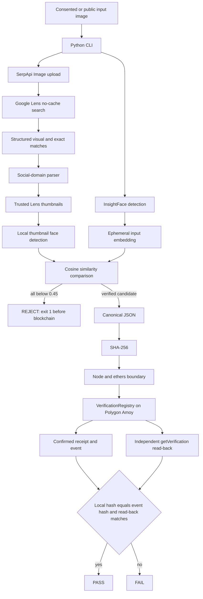

# Architecture

## System overview

The application has two runtime boundaries. Python owns image validation, face processing, SerpApi communication, Lens parsing, candidate verification, canonical serialization, and hashing. Node.js and ethers own Polygon Amoy submission, transaction confirmation, event extraction, and independent contract read-back.

## Components

| Component | Responsibility |
| --- | --- |
| `app/main.py` | CLI argument handling, safe non-zero failure exit |
| `app/pipeline/runner.py` | Six-stage orchestration and human-readable evidence |
| `app/face/` | Local InsightFace detection and embedding extraction |
| `app/reverse_search/client.py` | SerpApi upload and fresh Google Lens request |
| `app/reverse_search/parser.py` | Structured Lens parsing and social-domain classification |
| `app/reverse_search/verifier.py` | Trusted thumbnail retrieval, local face comparison, fail-closed selection |
| `app/utils/` | Deterministic canonical JSON and SHA-256 helpers |
| `blockchain/` | ethers payload conversion, write, receipt, event, and read-back |
| `contracts/VerificationRegistry.sol` | Immutable hash-keyed Amoy testnet records |
| `scripts/deploy.js` | Chain-gated contract deployment |

## Data flow

1. The CLI hashes the input file and asks InsightFace to detect faces.
2. Exactly one face is required. Its embedding remains in Python process memory.
3. SerpApi receives the input image and returns a fresh Google Lens response using `no_cache=true`.
4. The parser considers only top-level Lens `visual_matches` and `exact_matches`, then filters links through the supported social-domain allowlist.
5. For each candidate, the verifier downloads only the Lens-provided thumbnail from an allowlisted Google/SerpApi image domain. It enforces HTTPS, public DNS resolution, image content type, a five-megabyte maximum, successful decode, and detectable face evidence.
6. Candidate faces are embedded locally. Cosine similarity against the input embedding must meet `0.45`.
7. If no candidate qualifies, the Python process exits `1`; canonical payload construction and blockchain code are not reached.
8. A verified URL and platform enter canonical JSON with the input image hash, provider name, and schema version.
9. The SHA-256 digest and minimal public metadata cross the Python-to-Node boundary.
10. ethers verifies Amoy chain ID `80002`, writes or resolves an existing identical record, waits for a successful receipt, reads the contract, and compares all expected fields.

## Provider boundary

SerpApi is the only reverse-search provider. Credentials enter through `SERPAPI_API_KEY`; the key is not printed or placed in the canonical payload. The API response is processed in memory. Candidate selection does not rely on result order alone, titles, usernames, names, or preselected URLs.

Provider output is untrusted input. Only known result sections and supported social hosts are parsed. Candidate thumbnail hosts are independently restricted before network retrieval. Provider errors, timeouts, malformed JSON, missing IDs, and unavailable thumbnails cause explicit errors or candidate rejection.

## Face-processing boundary

The original input is read locally for hashing and InsightFace inference. SerpApi receives the image because reverse-image search necessarily requires it; the README makes this external disclosure explicit. Embeddings never leave local process memory. They are neither serialized nor returned in result metadata.

The system verifies visual correspondence between faces; it does not infer a name, legal identity, account ownership, authorship, or consent. Similarity is probabilistic, and the threshold is a project acceptance policy rather than a universal biometric guarantee.

## Blockchain boundary

The blockchain client receives only:

- canonical payload SHA-256
- verified public source URL
- platform

It refuses writes unless the connected chain is Polygon Amoy (`80002`). A new record emits `VerificationRegistered`; a repeated payload is resolved to its original event without attempting a duplicate write. Completion requires a confirmed receipt, matching event hash, and matching `getVerification` response.

## Trust boundaries

- **Local trusted boundary:** CLI, file hashing, model inference, embedding comparison, canonicalization.
- **External provider boundary:** SerpApi and Google Lens receive the source image and return untrusted web metadata.
- **Public-web boundary:** social URLs and thumbnails can be stale, misleading, unavailable, or malicious.
- **RPC boundary:** the configured Amoy RPC transports signed testnet transactions and read calls.
- **Public-chain boundary:** accepted metadata is permanently visible on Polygon Amoy.

## Failure paths

- Missing, oversized, unsupported, or unreadable input: stop before provider or chain as applicable.
- Zero or multiple input faces: stop before provider search.
- Provider authentication, quota, transport, or response failure: stop before selection.
- No social candidate: reject and stop before blockchain.
- Thumbnail trust, download, decode, or face-detection failure: reject that candidate.
- Similarity below `0.45`: reject that candidate.
- No verified candidate: exit `1`; never invoke Node/ethers.
- Wrong chain ID, failed transaction, missing event, or mismatched read-back: fail; never print PASS.

## Privacy boundaries

Ignored local material includes `.env`, input images under `examples/`, model binaries, embeddings, caches, logs, virtual environments, Node dependencies, and build output. Git tracks only source, tests, safe placeholders, and public testnet identifiers. Public testnet records are permanent, so only minimal metadata from an approved verified result should cross that boundary.
